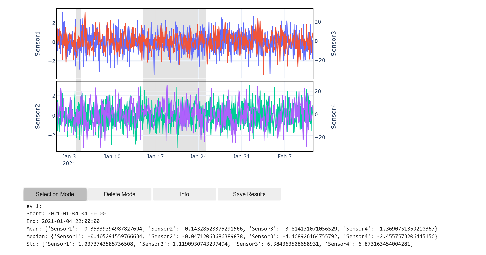

# InteracTimePy

**InteracTimePy** is a Python library for interactive time series visualization, annotation, and analysis. It allows users to explore multi-panel time series data, select intervals of interest, compute statistics, and add annotations seamlessly.

## Table of Contents

- [Features](#features)
- [Installation](#installation)
- [Dependencies](#dependencies)
- [Quick Start](#quick-start)
- [Usage](#usage)
  - [Preparing DataFrames](#preparing-dataframes)
  - [Defining Plot Configuration](#defining-plot-configuration)
  - [Running the Interactive Plot](#running-the-interactive-plot)
  - [Interacting with the Plot](#interacting-with-the-plot)
- [Function Reference](#function-reference)
- [Examples](#examples)
- [Contributing](#contributing)
- [License](#license)
- [Contact](#contact)

## Features

- **Interactive Visualization**: Explore time series data with synchronized zoom across multiple subplots.
- **Interval Selection**: Select time intervals interactively and highlight them across all subplots.
- **Statistical Analysis**: Compute mean, median, and standard deviation for selected intervals.
- **Annotations**: Add comments to selected intervals for detailed documentation.
- **Interval Deletion**: Remove intervals and their annotations interactively.
- **Multiple DataFrames Support**: Merge and visualize multiple time series DataFrames.
- **Customizable Plot Configuration**: Define subplot arrangements, axis types, and labels.
- **Resampling**: Resample time series data to a desired frequency.
- **Data Saving**: Save annotated intervals and statistics to files for future reference.

